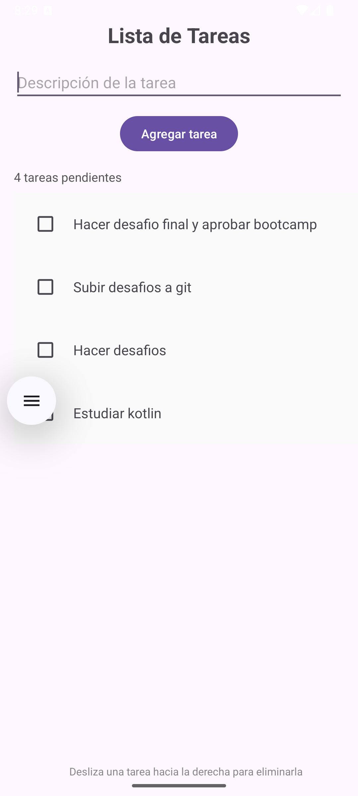

# 📋 TareasApp

**TareasApp** es una aplicación Android desarrollada en Kotlin que permite a los usuarios agregar y eliminar tareas de forma simple e intuitiva. 
Está diseñada como una lista de pendientes (to-do list), ideal para aprender y practicar conceptos básicos de desarrollo móvil.

## ✨ Funcionalidades

- Agregar nuevas tareas mediante un campo de texto.
- Mostrar todas las tareas en una lista (RecyclerView).
- Eliminar tareas deslizando hacia la derecha.
- Contador dinámico de tareas pendientes.
- Interfaz sencilla y amigable.

## 🛠️ Tecnologías utilizadas

- Kotlin
- Android Studio
- RecyclerView
- ViewBinding
- Swipe to delete (ItemTouchHelper)
- Gradle-8.14.2
- JDK 22.0.2

## Capturas de pantalla 📱

## 🚀 Cómo ejecutar

1. Clona el repositorio:
   
   git clone https://github.com/cbahamondesd/listatareas.git
